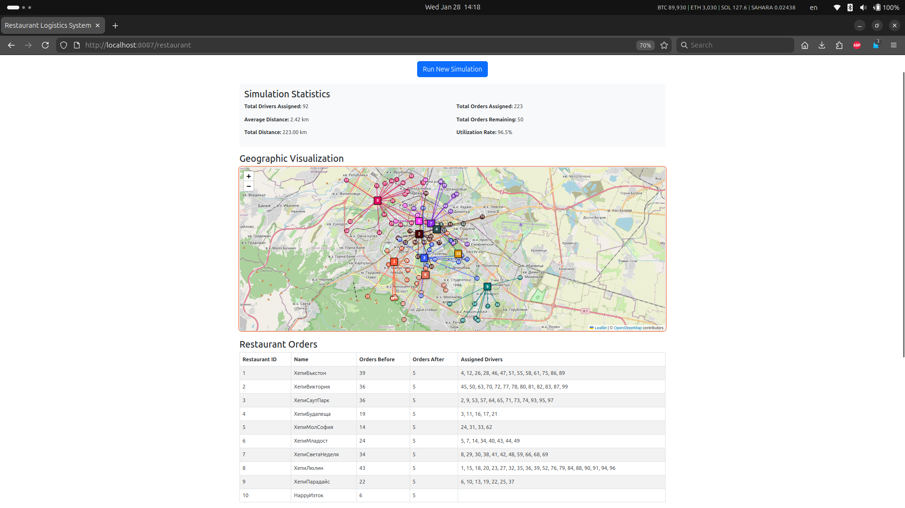

# Algorithm Orders Task

## Setup
```
git clone https://github.com/killedit/2026-01-27-alphavision-task.git
2026-01-27-alphavision-task
docker compose up -d --build
```

## DB

Option 1: Connect to `alphavision-mysql-1` container:

```
docker exec -it alphavision-mysql-1 bash
mysql -u root -p
    admin123
use alphavision;
show tables;
...
```

Option 2: Create a new db connection in DBeaver.

```
Server Host:    127.0.0.1
Port:           3307
Database:       alphavision
Username:       laravel_user
Password:       user123

Driver properties:
    allowPublicKeyRetrieval     TRUE
    useSSL                      FALSE

Test Connection...
```

## Application

A dockerized Laravel application that makes migrations and seeds the db at the setup step. It's creating 100 `drivers` randomply positioned on the map, fixed number of `restaurants` and random number of orders in each `restaurant`. The logic is that in the end each `restaurant` has same number of orders. `Drivers` that are closer to a `restaurant` are prefered, should not travel further than 5km and they can get only randomly 1-4 orders. I did not complicate things with one `driver` being able to get orders from more than one `restaurant`. Unassigned drivers are displayed in grey.

http://localhost:8087/restaurant 



# Refactoring

Created Service Classes.

The old solution was trying to fix bad assignements after they have happened.

The new solution is based on service classes that calculate best choice and assign driver. Now we needed parameters that can be tweaked.

```php
php artisan make:class Services/GeoService
php artisan make:class Services/RestaurantSystem
```

Old classes have been renamed with `_{class}` to avoid confusion.