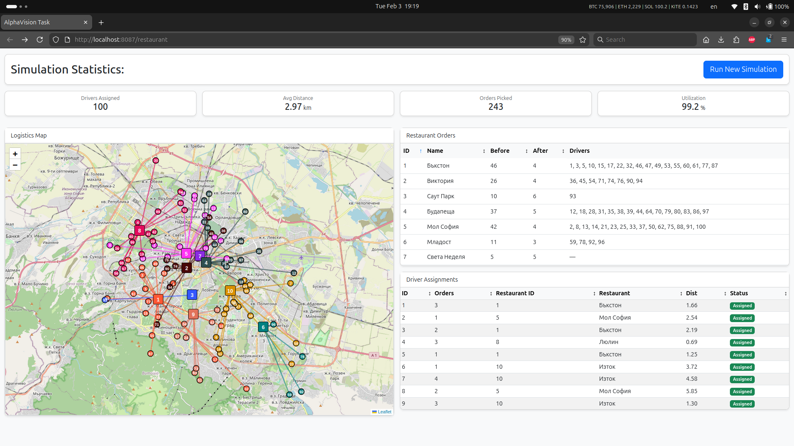
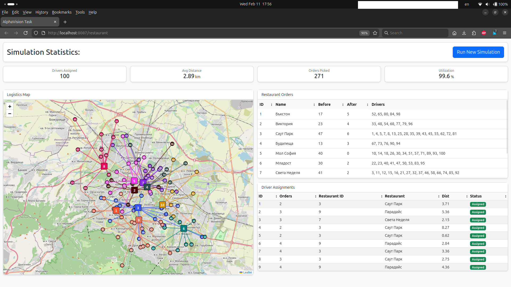

# Algorithm for assigning Drivers to Restaurant Orders

Randomly place 100 drivers with random number of orders (1-4) they can take. Place fixed positioned restaurants with random number of orders (5-50). Then calculate based on distance and orders weight the best solution to handle as many orders as possible.

## Setup
```
git clone https://github.com/killedit/2026-01-27-alphavision-task.git
2026-01-27-alphavision-task
docker compose up -d --build
```

## Conntect to the DB

Option 1: Connect to `alphavision-mysql-1` container:

```
docker exec -it alphavision-mysql-1 bash
mysql -u root -p
    admin123
use alphavision;
show tables;
...
```

Option 2: Create a new db connection in DBeaver.

```
Server Host:    127.0.0.1
Port:           3307
Database:       alphavision
Username:       laravel_user
Password:       user123

Driver properties:
    allowPublicKeyRetrieval     TRUE
    useSSL                      FALSE

Test Connection...
```

## The Application

A dockerized Laravel application that makes migrations and seeds the db at the setup step. It's creating 100 `drivers` randomply positioned on the map, fixed number of `restaurants` and random number of orders in each `restaurant`. The logic is that in the end each `restaurant` has same number of orders. `Drivers` that are closer to a `restaurant` are prefered, should not travel further than 5km and they can get only randomly 1-4 orders. I did not complicate things with one `driver` being able to get orders from more than one `restaurant`.

http://localhost:8087/restaurant




1. The solution is based on service classes.

```php
php artisan make:class Services/GeoService
php artisan make:class Services/RestaurantService
```

I am suing Dependency Injection and ask for RestaurantService in RestaurantController. Laravel's Service Container builds it. I depend on an abstraction (SOLID) without making instances of another classes. Business logic goes to RestaurantService - does the dispatching, GeoService - does the math.

2. We use `Collections` as parameters which allows solve() to work with any set of data. This is the right approach for running tests.

3. In "Before" state or `$before` vaiable we record the original state of the restaurants. <strong>Why not just use the `original` data in the Collection?</strong> The data is protected, but we could map it in the formatReportData() to $before object/array, but if I use $restaurants->save() or $restaurants->refresh() somewhere the `original` is overwritten with the current attributes. Anyway, this is also bad for testing, because if we use "fake" data often doesn't have `original` state, because it was not loaded from the db.

```json
array:10 [▼ // app/Services/RestaurantService.php:185
  0 => array:5 [▼
    "id" => 1
    "title" => "Бъкстон"
    "orders_count" => 17
    "lat" => "42.6671220"
    "lng" => "23.2816570"
  ]
  1 => array:5 [▶]
  2 => array:5 [▶]
  3 => array:5 [▶]
  4 => array:5 [▶]
  5 => array:5 [▶]
  6 => array:5 [▶]
  7 => array:5 [▶]
  8 => array:5 [▶]
  9 => array:5 [▶]
]

Illuminate\Database\Eloquent\Collection {#943 ▼ // app/Services/RestaurantService.php:185
  #items: array:10 [▼
    0 => App\Models
\
Restaurant {
#955 ▼
      #connection: "mysql"
      #table: "restaurants"
      #primaryKey: "id"
      #keyType: "int"
      +incrementing: true
      #with: []
      #withCount: []
      +preventsLazyLoading: false
      #perPage: 15
      +exists: true
      +wasRecentlyCreated: false
      #escapeWhenCastingToString: false
      #attributes: array:7 [▼
        "id" => 1
        "title" => "Бъкстон"
        "lat" => "42.6671220"
        "lng" => "23.2816570"
        "orders_count" => 3
        "created_at" => "2026-02-04 08:46:20"
        "updated_at" => "2026-02-04 08:47:59"
      ]
      #original: array:7 [▼
        "id" => 1
        "title" => "Бъкстон"
        "lat" => "42.6671220"
        "lng" => "23.2816570"
        "orders_count" => 17
        "created_at" => "2026-02-04 08:46:20"
        "updated_at" => "2026-02-04 08:47:59"
      ]
```

4. I use descriptive constants like MIN_ORDERS_PER_DRIVER to be able to tweak the results:

- `DISTANCE_WEIGHT = 1.0`;
- `ORDER_WEIGHT = 0.5`;

- `MIN_ORDERS_COUNT_PER_RESTAURANT` = 5;
- `MAX_ORDERS_COUNT_PER_RESTAURANT` = 50;

- `MIN_ORDERS_PER_DRIVER` = 1;
- `MAX_ORDERS_PER_DRIVER` = 4;

5. The function `findBestMatch()` is Greedy Algorithm which is the best solution for a small task.

The solution depends on two loops on Drivers and Restaurants. In `findBestMatches()` we have a formula that creates a score for each restaurant based on two parameters `DISTANCE_WEIGHT` of a driver to a restaurabt and `ORDER_WEIGHT` the number of orders in a restaurant.

For example for `Driver 1` we have this output for which I had to use `Log::debug({$var});` since dd(); is breaking the execution of the script. `tail -f laravel/storage/logs/laravel.log`. Of course it's a formatted result:

```json
$driver->id: 1,
$restaurant->id: 1,
$distance: 3.3060035712718,
$score: -5.1939964287282,
$bestScore: -5.1939964287282,
$bestDist: 3.3060035712718

$driver->id: 1,
$restaurant->id: 2,
$distance: 1.5938602940106,
$score: -1.4061397059894,
$bestScore: -5.1939964287282,
$bestDist: 3.3060035712718

$driver->id: 1,
$restaurant->id: 3,
$distance: 0.94085858491399,
$score: -18.059141415086,
$bestScore: -18.059141415086,
$bestDist: 0.94085858491399

$driver->id: 1,
$restaurant->id: 4,
$distance: 1.73857370365,
$score: -23.26142629635,
$bestScore: -23.26142629635,
$bestDist: 1.73857370365

$driver->id: 1,
$restaurant->id: 5,
$distance: 2.5415223251719,
$score: -21.958477674828,
$bestScore: -23.26142629635,
$bestDist: 1.73857370365

$driver->id: 1,
$restaurant->id: 6,
$distance: 5.8443875368169,
$score: -4.1556124631831,
$bestScore: -23.26142629635,
$bestDist: 1.73857370365

$driver->id: 1,
$restaurant->id: 7,
$distance: 2.1658204985125,
$score: -22.834179501488,
$bestScore: -23.26142629635,
$bestDist: 1.73857370365

$driver->id: 1,
$restaurant->id: 8,
$distance: 6.0909120781052,
$score: -16.409087921895,
$bestScore: -23.26142629635,
$bestDist: 1.73857370365

$driver->id: 1,
$restaurant->id: 9,
$distance: 2.2781453650513,
$score: -6.2218546349487,
$bestScore: -23.26142629635,
$bestDist: 1.73857370365

$driver->id: 1,
$restaurant->id: 10,
$distance: 2.4121545281641,
$score: -0.087845471835904,
$bestScore: -23.26142629635,
$bestDist: 1.73857370365
```

Here Restaurant with `id = 4` is picked and 3 orders `driver.capacity=3` are assigned to `driver.id = 1`, because this is the restaurant that has the highest (negative) score to this driver. The `$bestScore` is outside the restaurant loop so each driver has own restaurant score that is incrementing.

```json
0 => array:9 [▼
      "driver_id" => 1
      "driver_name" => "Driver 1"
      "lat" => "42.6771360"
      "lng" => "23.3197320"
      "restaurant_id" => 4
      "restaurant_title" => "Будапеща"
      "orders_assigned" => 3
      "distance" => 1.73857370365
      "score" => -23.26142629635 //we pick a restaurant where $score == bestScore
```

Added more meaningful metrics like `Utilization Rate` and `Average Distance`. I have decided to keep Lravel blade/view changes minimal and pass it the values it expected as before. I have only cleaned it up by taking JS scripts and styling out of the Blade view.</br>Made the view more condense with some basic Bootstrap cards and classes. Some columns like `Status` have no sense to be sortable, but in testing I had to make sure there are no Unassigned drivers as before.</br>

In conclusion the application works better now and restaurants with more orders are prefered than closer restaurants.</br>
This can be easily asessed on the map.</br>

## Unit Tests

I have created factories and run tests. It might be beeded to run `composer update` firstly.

```php
php artisan make:factory DriverFactory --model=Driver
php artisan make:factory RestaurantFactory --model=Restaurant

./vendor/bin/phpunit tests/Unit/GeoServiceTest.php
./vendor/bin/phpunit tests/Unit/RestaurantServiceTest.php
```

Test the `GeoService` for calculation the right distance between two points:

1. Same coordinates.
2. Two cities Sofia - Stara Zagora and knowing the distance.

https://latitude.to/map/bg/bulgaria/cities </br>
https://www.distancecalculator.net/from-sofia-to-stara-zagora </br>

RestaurantServiceTest.php tests:

1. Method solve() works correctly.
2. Constant ORDER_WEIGHT is respected.
3. Driver capacity - tehy should not take more orders than expected. Very similar to test (1), but here i test what will happen if the driver has capacity 10 which is in conflict with the contant of 1 to 4.
4. Test which driver will be preferred and what will happen if there are drivers with more capacity than restaurant orders.

## Integration test

Actually the Integration test helped me find an issue with my application. Stunner! I had to add this line  `$restaurant->save();` in solve() right after I remove orders from a restaurant to match what we expect in RestaurantIntegrationTest.php.

```php
./vendor/bin/phpunit tests/Feature/RestaurantIntegrationTest.php
```

This leads to adding this function in RestautantService, but I was not sure if it should be added in the Controller. Currently I use it only for the Intergration test:

```php
public function updateDatabaseAfterSolve($restaurants, $assignments) {
    foreach ($assignments as $assignment) {
        $restaurant = $restaurants->firstWhere('id', $assignment['restaurant_id']);
        $restaurant->decrement('orders_count', $assignment['orders_assigned']);
    }
}
```